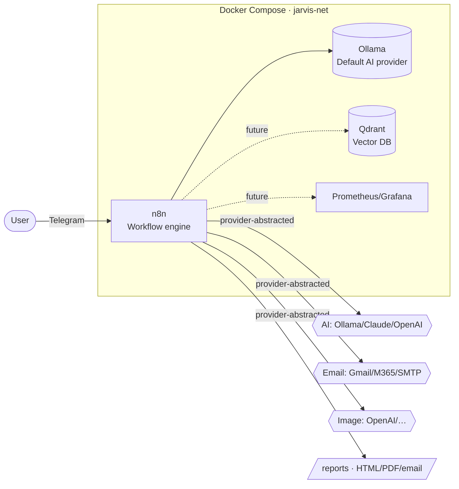

<!-- markdownlint-disable MD033 MD041 -->
<div align="center">

# 🤖 Jarvis — Personal AI Assistant Platform

**Docker-first · Modular · Recoverable · Observable · Secure by default**

A self-hostable personal AI assistant built on [n8n](https://n8n.io) and
[Ollama](https://ollama.com), with a Telegram interface, a daily cyber-threat
intelligence brief, an email assistant, and a plugin architecture for future
capabilities — all reproducible from a single idempotent installer.

</div>

---

## Why Jarvis

Jarvis is engineered as a **long-term product**, not a throwaway experiment.
Every design decision optimises for maintainability, reliability,
recoverability, observability, security and future expansion so that major
architectural refactoring is avoided later. The guiding principles:

- **Infrastructure as Code** — the whole stack is declared and reproducible.
- **Configuration over hard coding** — behaviour is driven by `.env` and
  declarative descriptors, never baked into code.
- **Modular architecture / Separation of concerns** — every component is
  replaceable without redesigning the system.
- **Idempotent operations** — the installer and tooling are safely re-runnable.
- **Stateless services where possible** & **fail-safe defaults**.
- **Security by default** — public repo, zero secrets committed.
- **Observability by default** — structured logging, health checks, status.
- **Documentation as code** — docs live beside the code they describe.

## Architecture at a glance



See [`docs/architecture.md`](docs/architecture.md) for the full design.

## Quick start

```bash
# 1. Clone
git clone https://github.com/peakapot/jarvis-ai.git
cd jarvis-ai

# 2. Install (validates the host, generates .env, starts the stack,
#    pulls the default model, imports workflows, runs health checks)
./install.sh

# 3. Add your credentials to the generated .env (Telegram, email, …)
#    then re-run — completed steps are skipped (idempotent)
./install.sh

# 4. Verify
scripts/healthcheck.sh
scripts/status.sh
```

A new user can `git clone` → `./install.sh` → provide variables → message the
Telegram bot → receive a reply and a daily cyber brief → run diagnostics, health
checks, backup, restore and upgrade — **without manually editing any code**.

## Core capabilities

| Capability | Description | Entry point |
|------------|-------------|-------------|
| **Telegram Assistant** | Primary interface with a command architecture (`/help`, `/status`, `/research`, `/emails`, `/image`, `/cyber`, `/opportunities`, `/energy`) — new commands are easy to add. | `workflows/core/telegram-assistant.json` |
| **Cyber Brief** | Professional daily threat-intelligence product: Executive & Technical summaries, Top Threats, Recommended Actions, Emerging Trends, UAE Relevance, Historical Archive — rendered to HTML/PDF/email. | `workflows/core/cyber-brief.json` |
| **Cyber Opportunities Brief** | Daily commercial-opportunity radar (RFPs, RFIs, tenders, MSS, GRC, SOC, OT/CNI, cloud & AI security) with a GCC-first focus; premium HTML/PDF/email/archive with an AI cover image. | `modules/cyber-opportunities/` |
| **Energy Intelligence Brief** | Daily UAE/ADNOC-focused energy intelligence (ADNOC ecosystem, then regional & global oil & gas) with the same premium output and AI cover image. | `modules/energy-intelligence/` |
| **Email Assistant** | Inbox summaries, draft replies, categorisation & prioritisation, thread summaries. | `prompts/email-assistant/` |
| **Error Handler** | Central failure path for every workflow: structured logging + alerting. | `workflows/core/error-handler.json` |

## Intelligence products

Jarvis runs a **registry-driven intelligence framework**: three daily briefs —
**Cyber Threat**, **Cyber Opportunities** and **Energy** — share one reusable
pipeline (provider-abstracted AI, sources files, schedules, archive) and one
**common premium branding framework** ([`config/intelligence/branding.json`](config/intelligence/branding.json)),
so every brief has a consistent, premium style across HTML/PDF/email, each
opened by an **AI-generated cover image** built from the day's top stories. The
registry [`config/intelligence/products.json`](config/intelligence/products.json)
is the single source of truth — install, validate, health, status and backup all
iterate it, so future products (Defence, AI, Government, Healthcare, Market) are
added as a module + registry entry with **no core code changes**. See
[`docs/intelligence-products.md`](docs/intelligence-products.md).

## Provider abstraction

Switching providers is a **configuration change, not a code change**. Select the
active provider in `.env`; declarative descriptors in `config/providers/` define
how each is reached. **Ollama is the default AI provider.**

| Kind | Variable | Options |
|------|----------|---------|
| AI | `AI_PROVIDER` | `ollama` (default), `claude`, `openai` |
| Email | `EMAIL_PROVIDER` | `smtp`, `gmail`, `microsoft365` |
| Image | `IMAGE_PROVIDER` | `openai`, … |

## Plugin modules (future expansion)

New capabilities are added as self-contained modules under `modules/`, each with
its own configuration, prompts, workflows, documentation and health checks:
`knowledge-assistant`, `meeting-assistant`, `calendar-assistant`,
`iso27001-assistant`, `mindhaven-assistant`, `dealforge-assistant`,
`presentation-assistant`, `image-assistant`. See
[`modules/README.md`](modules/README.md).

## Operations toolkit

| Task | Command |
|------|---------|
| Pre-install validation | `scripts/validate.sh` |
| Health check | `scripts/healthcheck.sh [--json]` |
| Status dashboard | `scripts/status.sh [--json]` |
| Diagnostics bundle | `scripts/diagnostics.sh` |
| Full backup | `./backup.sh [--with-data]` |
| Restore | `./restore.sh [archive] [--with-data]` |
| Workflow backup/restore | `scripts/workflows/workflow-backup.sh` · `…/workflow-restore.sh` |
| Workflow migrate | `scripts/workflows/workflow-migrate.sh` |

## Documentation

Full, enterprise-quality documentation lives in [`docs/`](docs/README.md):
architecture, installation, operations, administration, backup, recovery,
troubleshooting, upgrade and development guides, plus operational runbooks.

## Repository layout

```
.
├── install.sh              # Idempotent bootstrap installer
├── backup.sh / restore.sh  # Full system backup & <15-min recovery
├── docker-compose.yml      # Service topology (n8n, ollama, future profiles)
├── .env.example            # Configuration template (copy to .env)
├── config/                 # Provider descriptors, feeds, templates
│   └── providers/          #   AI / email / image abstraction
├── scripts/                # Validation, health, status, diagnostics, libs
│   ├── lib/                #   Shared shell library (logging, state, common)
│   └── workflows/          #   Workflow lifecycle tooling
├── workflows/              # Workflows as source code (core + modules)
├── prompts/                # First-class, versioned prompt assets
├── modules/                # Plugin architecture (one folder per capability)
├── templates/              # Email/report templates
├── reports/                # Generated intelligence products + archive
├── docs/                   # Documentation as code
├── logs/ backups/ state/   # Runtime (git-ignored)
└── .github/                # CI
```

## Security

This is a **public repository** that contains **no secrets, credentials, API
keys or tokens**. All secrets live only in your local, git-ignored `.env`
(generated by the installer with `chmod 600`). See
[`SECURITY.md`](SECURITY.md).

## Contributing & roadmap

See [`CONTRIBUTING.md`](CONTRIBUTING.md) and [`ROADMAP.md`](ROADMAP.md).
Changes are tracked in [`CHANGELOG.md`](CHANGELOG.md).

## License

Released under the MIT License — see [`LICENSE`](LICENSE).
