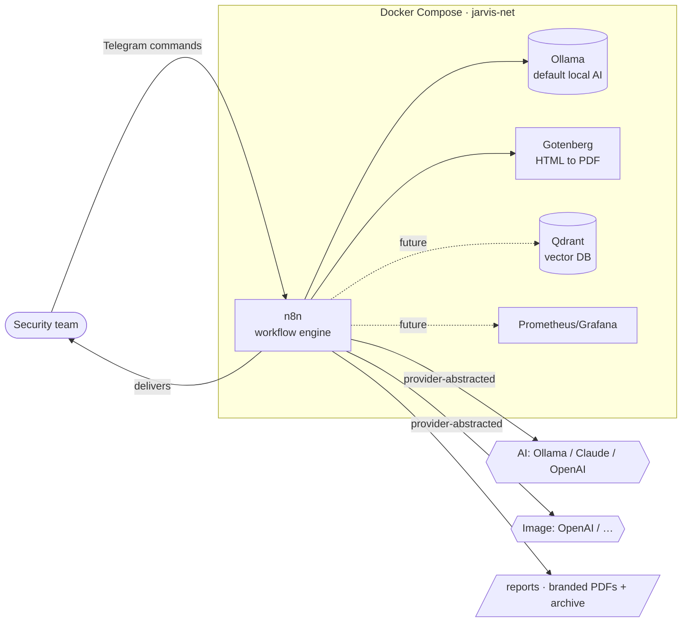

<!-- markdownlint-disable MD033 MD041 -->
<div align="center">

# 🛡️ Jarvis — AI Cyber Awareness Assistant

**Automated cyber-awareness intelligence & content for security teams**

Docker-first · Modular · Recoverable · Observable · Secure by default

Jarvis is a self-hostable AI assistant that produces **professional,
magazine-quality cyber intelligence** and a full **security-awareness content
toolkit** — delivered straight to Telegram and as branded PDFs. It is built for a
security awareness & training team to run for their organisation and their
clients, on [n8n](https://n8n.io) + [Ollama](https://ollama.com), and is
reproducible from a single idempotent installer.

</div>

---

## What Jarvis delivers

- 📰 **Weekly intelligence magazines** — *Cybersecurity Talent* (awareness &
  skills), *Cyber Defence Watch* (an OSINT cyber-defence brief themed for the KSA
  Ministry of Defence), plus *Cyber Opportunities* and *Energy* briefs. Each is a
  designed, multi-page PDF with a custom AI cover, journalistic write-ups, live
  data and source references.
- 🧰 **On-demand awareness toolkit** — generate posters, one-page explainers,
  quizzes & "spot-the-phish" packs, tabletop exercises, micro-tips & lock-screen
  cards, news-triggered "teachable moment" notes, client KPI reports,
  **interactive e-learning modules (HTML + SCORM)**, **completion certificates**,
  **12-month campaign calendars**, **video scripts & storyboards**, and
  **digital-signage slides** — each on request via a single Telegram command.
- 🎓 **Learning Hub** — a one-run **read → learn → certify** loop: a monthly staff
  awareness **magazine** *plus* an **e-learning course built from that edition**,
  surfaced in a **local Learning Dashboard** with completion tracking, a personal
  **certificate library** and a **30-day** completion window.
- 💬 **Conversational Telegram interface** — the team drives everything with
  simple commands (`/poster phishing`, `/tabletop ransomware`, `/quiz mfa`, …);
  finished assets are saved and returned in chat.
- 🎨 **White-label per client** — set one variable (`CLIENT_NAME`) to brand
  every asset for a specific client; theming (e.g. the KSA green/gold defence
  brief) is configuration-driven.
- 🔌 **Provider-abstracted AI** — local-first **Ollama** by default, or switch to
  **Claude**/**OpenAI** with a single setting. Cover/poster art via an image
  provider; HTML→PDF via Gotenberg.

> Everything runs in your own environment. The repository contains **no secrets** —
> all credentials live only in your local, git-ignored `.env`.

## Quick start

```bash
# 1. Clone
git clone https://github.com/peakapot/jarvis-ai.git
cd jarvis-ai

# 2. Install — validates the host, generates .env, starts the stack,
#    pulls the default model, imports workflows, runs health checks
./install.sh

# 3. Add your credentials to the generated .env (Telegram bot, AI keys, …)
#    then re-run — completed steps are skipped (idempotent)
./install.sh

# 4. Verify
scripts/healthcheck.sh
scripts/status.sh
```

Then message the Telegram bot, request a brief or an awareness asset, and receive
a branded PDF — **without editing any code**.

## Capabilities at a glance

| Capability | What it produces | Entry point |
|------------|------------------|-------------|
| **Telegram Assistant** | The control surface: `/help`, `/status`, `/cyber`, `/defence`, `/energy`, `/opportunities`, plus the awareness toolkit `/poster`, `/explainer`, `/quiz`, `/tabletop`, `/tips`, `/teachable`, `/kpi`, `/elearning`, `/certificate`, `/calendar`, `/videoscript`, `/signage`. | `workflows/core/telegram-assistant.json` |
| **Cybersecurity Talent** *(weekly magazine)* | Awareness & skills magazine: editorial, featured training technique, training technology, qualifications & courses, in-demand skills, the human firewall, emerging threats — journalistic briefs, custom AI cover, references. | `workflows/core/cyber-brief.json` |
| **Cyber Defence Watch** *(weekly brief)* | OSINT cyber-defence brief themed for the **KSA Ministry of Defence**: allied policy & capability (US/UK/Five Eyes/NATO), Middle East defence cyber, defence-impacting breaches, threat actors, and a bespoke *Implications for KSA MOD* assessment. | `workflows/core/defence-cyber.json` |
| **Cyber Opportunities Brief** *(daily)* | Commercial-opportunity radar (RFPs, tenders, MSS, GRC, SOC, OT/CNI, cloud & AI security) with a GCC-first focus. | `modules/cyber-opportunities/` |
| **Energy Intelligence Brief** *(daily)* | UAE/ADNOC-focused energy intelligence with live oil & gas prices and an AI cover. | `modules/energy-intelligence/` |
| **Learning Hub** *(monthly + on-demand)* | A staff awareness **magazine** + an **e-learning course derived from that edition**, registered as a publication; a **local Learning Dashboard** (nginx) shows publications, completion status, a **certificate library** and a 30-day deadline. | `modules/learning-hub/` |
| **Awareness Toolkit** *(on-demand)* | Posters, explainers, quizzes, tabletop packs, micro-tips, teachable-moment notes, KPI reports, e-learning modules (HTML + SCORM), completion certificates, campaign calendars, video scripts & storyboards, digital-signage slides — files to `reports/awareness/`. | `workflows/awareness/` |

## Intelligence magazines

Jarvis runs a **registry-driven intelligence framework**: four briefs —
**Cybersecurity Talent**, **Cyber Defence Watch** (KSA MOD), **Cyber
Opportunities** and **Energy** — share one reusable pipeline (provider-abstracted
AI, source feeds, schedules, archive) and one common premium design system, so
every issue has a consistent, magazine-quality style opened by an
**AI-generated cover**. The registry
[`config/intelligence/products.json`](config/intelligence/products.json) is the
single source of truth — install, validate, health-check, status and backup all
iterate it, so a **new brief is added as one registry entry + workflow, with no
core code changes**. See [`docs/intelligence-products.md`](docs/intelligence-products.md).

## Awareness toolkit

On-demand security-awareness asset generators for an awareness team and its
clients. Each is a self-contained workflow under
[`workflows/awareness/`](workflows/awareness/README.md) that reuses the same
engine (provider-abstracted AI → image/Gotenberg → file) and writes ready-to-use
assets to `reports/awareness/`. Trigger by a **Telegram command** (topic in the
command, e.g. `/poster mfa`) or **manually** in n8n — a short **form** pops up to
choose the topic, audience, tone and per-tool options. Output is generic-branded
until `CLIENT_NAME` is set for white-label delivery.

| Tool | Command | Output |
|------|---------|--------|
| Poster & Explainer | `/poster <topic>` · `/explainer <topic>` | A4 poster + one-page explainer PDF |
| Quiz & Spot-the-Phish | `/quiz <topic>` | participant + facilitator answer-key PDF |
| Tabletop Exercise | `/tabletop <scenario>` | scenario, roles, timed injects, debrief PDF |
| Micro-Tips & Cards | `/tips <theme>` | printable tips + lock-screen cards (also weekly) |
| Teachable Moment | `/teachable` | news-triggered "what happened / why / what to do" note (also weekly) |
| KPI Report | `/kpi` | client metrics report from `config/awareness/kpi-input.json` |
| E-learning Module | `/elearning <topic>` | interactive HTML lesson + SCORM 1.2 package (scored knowledge check) |
| Completion Certificate | `/certificate <name>` | diploma-style certificate PDF (landscape, unique ID) |
| Campaign Calendar | `/calendar [year]` | 12-month awareness plan PDF + `.ics` calendar feed |
| Video Script & Storyboard | `/videoscript <topic>` | script + storyboard PDF (scene cards) |
| Digital-Signage Slides | `/signage <topic>` | 1920×1080 PNG slides bundled as a `.zip` |

## Learning Hub

The **Learning Hub** module ([`modules/learning-hub/`](modules/learning-hub/README.md))
links a publication to training: a single run builds a monthly staff
security-awareness **magazine** and then an **interactive e-learning course derived
strictly from that edition**, registering both as a *publication* in
`reports/learning-hub/publications.json`.

A **local Learning Dashboard** (a static nginx service that ships with the stack)
presents it to learners:

```bash
docker compose up -d dashboard      # starts the dashboard service
# then open http://localhost:8088   (DASHBOARD_PORT)
```

From the dashboard a learner can **read the magazine anytime**, **complete the
e-learning** (which then shows **Complete**), and keep a personal **certificate
library** of their progress. Each edition has a **30-day** completion window from
release (the magazine stays readable indefinitely; the course shows a countdown and
an *Overdue* badge after 30 days). Progress is stored in the browser for this
single-user demo. Generate the first edition by running the
*Jarvis · Learning Hub — Publication + Course* workflow in n8n (or wait for the
monthly schedule). It is a self-contained module and leaves the existing magazines
and awareness toolkit untouched.

## How it works



Switching providers is a **configuration change, not a code change**:

| Kind | Variable | Options |
|------|----------|---------|
| AI | `AI_PROVIDER` | `ollama` (default), `claude`, `openai` |
| Image | `IMAGE_PROVIDER` | `openai`, … |
| Email | `EMAIL_PROVIDER` | `smtp`, `gmail`, `microsoft365` |

See [`docs/architecture.md`](docs/architecture.md) for the full design.

## Built to last

Jarvis is engineered as a **long-term product**, not a throwaway experiment —
optimised for reliability, recoverability, observability and security so it can
be handed over and operated with confidence:

- **Infrastructure as Code** — the whole stack is declared and reproducible.
- **Configuration over hard coding** — behaviour is driven by `.env` and
  declarative descriptors.
- **Modular architecture** — every component is replaceable without a redesign;
  new briefs/tools are added without touching the core.
- **Idempotent operations** — the installer and tooling are safely re-runnable.
- **Security by default** — public repo, zero secrets committed.
- **Observability by default** — structured logging, health checks, status.
- **Documentation as code** — docs live beside the code they describe.

## Operations toolkit

| Task | Command |
|------|---------|
| Pre-install validation | `scripts/validate.sh` |
| Health check | `scripts/healthcheck.sh [--json]` |
| Status dashboard | `scripts/status.sh [--json]` |
| Diagnostics bundle | `scripts/diagnostics.sh` |
| Full backup / restore | `./backup.sh [--with-data]` · `./restore.sh [archive]` |
| Workflow lifecycle | `scripts/workflows/workflow-backup.sh` · `…-restore.sh` · `…-migrate.sh` |

## Repository layout

```
.
├── install.sh              # Idempotent bootstrap installer
├── backup.sh / restore.sh  # Full system backup & rapid recovery
├── docker-compose.yml      # Service topology (n8n, ollama, gotenberg, profiles)
├── .env.example            # Configuration template (copy to .env)
├── config/                 # Provider descriptors, feeds, intelligence registry
├── workflows/              # Workflows as source code (core + awareness toolkit)
│   └── awareness/          #   On-demand awareness asset generators
├── modules/                # Plugin architecture (one folder per capability)
├── prompts/                # First-class, versioned prompt assets
├── templates/              # Report/email templates
├── reports/                # Generated magazines + awareness assets + archive
├── scripts/                # Validation, health, status, diagnostics, libs
├── docs/                   # Documentation as code
└── logs/ backups/ state/   # Runtime (git-ignored)
```

## Documentation

Full documentation lives in [`docs/`](docs/README.md): architecture,
installation, operations, administration, backup, recovery, troubleshooting,
upgrade and development guides, plus the
[intelligence-products guide](docs/intelligence-products.md) and the
[awareness toolkit guide](workflows/awareness/README.md).

## Security

This is a **public repository** containing **no secrets, credentials, API keys
or tokens**. All secrets live only in your local, git-ignored `.env` (generated
by the installer with `chmod 600`). See [`SECURITY.md`](SECURITY.md).

## Contributing, roadmap & licence

See [`CONTRIBUTING.md`](CONTRIBUTING.md), [`ROADMAP.md`](ROADMAP.md) and
[`CHANGELOG.md`](CHANGELOG.md). Released under the MIT License — see
[`LICENSE`](LICENSE).
