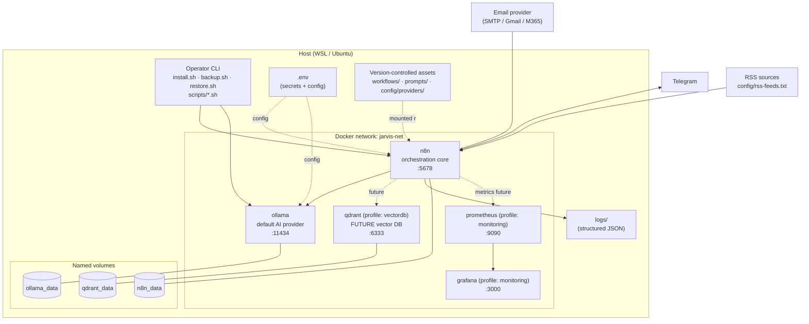
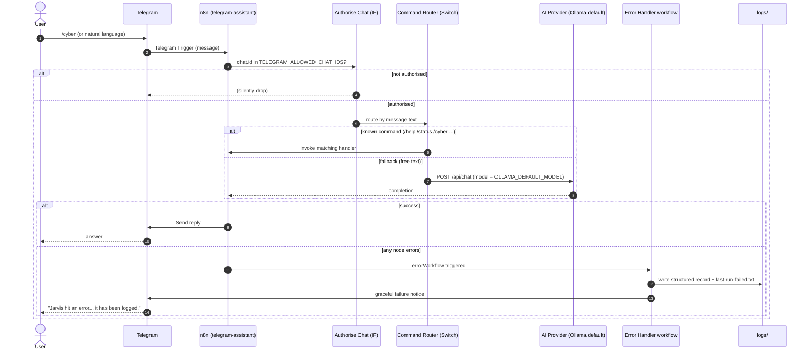

# Architecture

System architecture for **Jarvis**, a Docker-first personal AI assistant
platform built on [n8n](https://n8n.io) (workflow orchestration) and
[Ollama](https://ollama.com) (local-first LLM runtime).

> See also: [installation.md](installation.md) · [operations.md](operations.md)
> · [administration.md](administration.md) · [development.md](development.md) ·
> [diagrams/README.md](diagrams/README.md)

## Table of contents

- [High-level overview](#high-level-overview)
- [Engineering principles](#engineering-principles)
- [Docker service topology](#docker-service-topology)
- [Component and container topology](#component-and-container-topology)
- [Component responsibilities](#component-responsibilities)
- [Provider abstraction layer](#provider-abstraction-layer)
- [Workflows as source code](#workflows-as-source-code)
- [Prompt management](#prompt-management)
- [State and idempotency model](#state-and-idempotency-model)
- [Logging and observability](#logging-and-observability)
- [Storage architecture and the knowledge base](#storage-architecture-and-the-knowledge-base)
- [Plugin / module architecture](#plugin--module-architecture)
- [Request flow: a Telegram message round-trip](#request-flow-a-telegram-message-round-trip)

## High-level overview

Jarvis is a self-hosted assistant platform. Everything that can run in a
container does ([`docker-compose.yml`](../docker-compose.yml)); everything that
configures the system lives in [`.env`](../.env.example); and everything that
defines behaviour — workflows, prompts, provider descriptors — is plain text
under version control. A single idempotent entry point,
[`install.sh`](../install.sh), stands the whole stack up, and a small library of
shell scripts under [`scripts/`](../scripts) operates it.

The core runtime is two services:

- **n8n** — the orchestration core. Every capability (Telegram assistant, email
  assistant, cyber brief) is an n8n workflow.
- **Ollama** — the default, local-first AI provider. No data leaves the host
  unless an operator explicitly selects a remote provider.

Optional, future services (a vector database and a monitoring stack) are wired
into Compose behind **profiles** so the base stack stays lean while leaving a
no-redesign path to enable them later.

## Engineering principles

The architecture is shaped by a fixed set of principles. They are referenced
throughout this document and the rest of the docs:

| Principle | How it shows up |
| --- | --- |
| Infrastructure as Code | The stack is declared in `docker-compose.yml`; `install.sh` is the only bootstrap. |
| Configuration over hard coding | All tunables come from `.env`; provider selection and feeds are config files. |
| Modular architecture | Decoupled, individually replaceable services; self-contained `modules/`. |
| Separation of concerns | Prompts live outside workflows; secrets live outside everything tracked. |
| Idempotent operations | Install, import and migrate are re-runnable and resume safely. |
| Fail-safe defaults | Strict bash mode, integrity checks before mutation, graceful degradation. |
| Security by default | Secrets stay in `.env`; never enter Git, backups or diagnostics. |
| Observability by default | Structured JSON logs, health checks, a status dashboard, diagnostics bundles. |
| Documentation as code | These docs and the Mermaid diagrams live in-repo and are reviewed in PRs. |

## Docker service topology

Services are defined in [`docker-compose.yml`](../docker-compose.yml). Optional
services are gated behind Compose **profiles**:

| Service | Profile | Image (override in `.env`) | Default port | Purpose |
| --- | --- | --- | --- | --- |
| `n8n` | (default) | `N8N_IMAGE` | `5678` | Workflow automation engine / orchestration core. |
| `ollama` | (default) | `OLLAMA_IMAGE` | `11434` | Default local-first AI provider. |
| `qdrant` | `vectordb` | `QDRANT_IMAGE` | `6333` | **Future** vector DB for knowledge base / long-term memory. |
| `prometheus` | `monitoring` | `PROMETHEUS_IMAGE` | `9090` | **Future** metrics collection. |
| `grafana` | `monitoring` | `GRAFANA_IMAGE` | `3000` | **Future** dashboards. |

Cross-cutting topology facts:

- **Network.** All services join an external Docker network
  (`JARVIS_DOCKER_NETWORK`, default `jarvis-net`). `install.sh` creates it
  up-front so multiple modules can share it. Services address each other by
  container name (e.g. n8n reaches Ollama at
  `http://jarvis-ollama:11434`).
- **Volumes.** Named volumes persist state: `n8n_data` (encrypted credentials +
  execution DB), `ollama_data` (model store), plus `qdrant_data`,
  `prometheus_data`, `grafana_data` for the optional services.
- **Bind mounts.** n8n bind-mounts `./logs`, `./workflows` (read-only) and
  `./prompts` (read-only) so source-controlled assets and structured logs are
  visible to both the container and the host tooling.
- **Health checks.** Both core services declare container `healthcheck`s; n8n
  `depends_on` Ollama having started.
- **Logging driver.** Every service uses the `json-file` driver with bounded
  size/rotation (`DOCKER_LOG_MAX_SIZE` / `DOCKER_LOG_MAX_FILE`).
- **Restart policy.** `unless-stopped` for resilience across host reboots.

## Component and container topology



This diagram is kept as Mermaid source — see
[diagrams/README.md](diagrams/README.md) for why.

## Component responsibilities

- **n8n** — hosts and executes every workflow. Owns scheduling (cron triggers),
  the Telegram webhook/poller, HTTP calls to providers, file writes to `logs/`
  and `reports/`, and the central error workflow. Persists workflows,
  credentials and executions in `n8n_data`. Execution data is pruned
  automatically (`EXECUTIONS_DATA_PRUNE=true`, age `N8N_EXEC_MAX_AGE_HOURS`).
- **Ollama** — serves local LLM inference (`/api/chat`, `/api/generate`,
  `/api/tags`). The default model is `OLLAMA_DEFAULT_MODEL` (`llama3.1:8b`),
  pulled by `install.sh` stage 6.
- **Operator CLI** — the scripts under [`scripts/`](../scripts) and the
  root-level [`install.sh`](../install.sh), [`backup.sh`](../backup.sh),
  [`restore.sh`](../restore.sh). They share a common library
  ([`scripts/lib/`](../scripts/lib)) for strict mode, logging, state and
  `compose` resolution.
- **Future services** — `qdrant` (knowledge base / long-term memory),
  `prometheus` + `grafana` (observability). Declared but disabled by default;
  enable with the relevant profile.

## Provider abstraction layer

Provider selection is a **configuration** concern, not a code change
(*Configuration over hard coding*, *Separation of concerns*). Three provider
kinds are abstracted: **AI**, **image** and **email**.

How it works:

1. Each provider is described by a declarative JSON **descriptor** under
   [`config/providers/<kind>/<id>.json`](../config/providers), validated against
   [`config/providers/provider.schema.json`](../config/providers/provider.schema.json).
   A descriptor lists capabilities, endpoint facts and the **env var names**
   that hold any secrets — never the secret values themselves.
2. The active provider for each kind is chosen by an env var:
   - `AI_PROVIDER` — `ollama` (default) · `claude` · `openai`
   - `IMAGE_PROVIDER` — `openai`
   - `EMAIL_PROVIDER` — `smtp` (default) · `gmail` · `microsoft365`
3. [`scripts/providers/resolve-provider.sh`](../scripts/providers/resolve-provider.sh)
   is the single source of truth. Given a kind it reads the relevant
   `*_PROVIDER` variable, loads the matching descriptor, substitutes env values,
   and prints resolved, non-secret connection facts as JSON. Workflows and
   scripts call the resolver instead of hard-coding any endpoint or auth.

```bash
# Which AI provider is active and how do I reach it?
scripts/providers/resolve-provider.sh ai

# Force a specific descriptor regardless of *_PROVIDER.
scripts/providers/resolve-provider.sh ai --id claude
scripts/providers/resolve-provider.sh email
```

Shipped descriptors:

| Kind | IDs | Default |
| --- | --- | --- |
| `ai` | `ollama`, `claude`, `openai` | `ollama` |
| `email` | `smtp`, `gmail`, `microsoft365` | `smtp` |
| `image` | `openai` | `openai` |

**Ollama is the default AI provider**: it is local-first, requires no API key,
and keeps all inference on the host. Switching to a remote AI provider is a
matter of setting `AI_PROVIDER` and supplying the relevant API key in `.env`.
See [administration.md](administration.md#switching-providers) for the
operational procedure.

## Workflows as source code

A core rule: *no workflow may exist only inside the n8n UI*. Workflows are
version-controlled JSON:

```
workflows/
├── core/        curated, hand-maintained core workflows
│   ├── telegram-assistant.json
│   ├── cyber-brief.json
│   └── error-handler.json
├── modules/     per-plugin module workflows
└── exported/    round-trip mirror of live n8n state (git-ignored by default)
```

The lifecycle is managed by scripts in
[`scripts/workflows/`](../scripts/workflows):

- **Import** — [`workflow-import.sh`](../scripts/workflows/workflow-import.sh)
  loads `core/` then `modules/` (and `exported/` with `--include-exported`) into
  n8n via `n8n import:workflow`. n8n upserts by id, so re-running is idempotent —
  existing workflows are updated, not duplicated.
- **Export** — [`workflow-export.sh`](../scripts/workflows/workflow-export.sh)
  pulls all workflows out of live n8n into `workflows/exported/` as pretty JSON,
  so UI changes become reviewable diffs.
- **Validate** —
  [`workflow-validate.sh`](../scripts/workflows/workflow-validate.sh) checks
  every file for valid JSON, the n8n shape (`nodes` array + `connections`
  object), and the absence of plaintext secrets — run before any import, backup
  or migration (*Fail-safe defaults*, *Security by default*).
- **Migrate** —
  [`workflow-migrate.sh`](../scripts/workflows/workflow-migrate.sh) applies
  ordered, idempotent, state-tracked migrations (see
  [upgrade.md](upgrade.md#workflow-migrations)).
- **Backup / restore** —
  [`workflow-backup.sh`](../scripts/workflows/workflow-backup.sh) and
  [`workflow-restore.sh`](../scripts/workflows/workflow-restore.sh) produce and
  consume checksum-verified, versioned archives of the `workflows/` tree.

Every workflow declares a central `errorWorkflow` (`Jarvis · Error Handler`) so
each capability has a consistent failure path.

## Prompt management

Prompts are **first-class, versioned assets stored outside workflows**, so the
language can be tuned without editing automation logic (*Separation of
concerns*). They live under [`prompts/`](../prompts):

- [`prompts/registry.json`](../prompts/registry.json) maps a stable prompt `id`
  to its file and semantic `version` (workflows reference prompts by id).
- Each prompt is a Markdown file with **YAML frontmatter**
  (`id`, `version`, `purpose`, `owner`, `variables`, `provider_agnostic`) and a
  `## Changelog` section. Variables are interpolated as `{{NAME}}`.

```
prompts/
├── registry.json
├── system/jarvis-core.md          # global persona + guardrails
├── telegram/router.md             # intent classification
├── cyber-brief/analyst.md
└── email-assistant/{summarize-inbox,draft-reply,categorize}.md
```

See [development.md](development.md#adding-a-prompt) for the add-a-prompt flow.

## State and idempotency model

The installer's re-runnability is backed by
[`scripts/lib/state.sh`](../scripts/lib/state.sh). State is filesystem-based —
no database dependency:

- Each task has a marker file under `state/tasks/<task-id>` whose contents
  record status + UTC timestamp (`done 2026-06-05T12:00:00Z`).
- `ensure_task <id> "Description" <command>` is the workhorse: it skips a task
  already marked `done`, otherwise runs it and records `done` or `failed`.
- Recovery is trivial: delete one marker to force a step to re-run, or run
  `./install.sh --reset` to wipe all markers (which **does not** delete data).

Workflow migrations use the same mechanism, recording a per-file marker
(`wf-migrate:<workflow>:<migration>`) so each migration applies exactly once.

## Logging and observability

Structured logging is implemented in
[`scripts/lib/logging.sh`](../scripts/lib/logging.sh). Every log line is emitted
twice (*Observability by default*):

1. A human-readable, colourised line to **stderr** (so stdout stays clean for
   data/pipelines; colour is auto-disabled for non-TTY / `NO_COLOR`).
2. A structured **JSON** line appended to a per-component file under `logs/`:

   ```json
   {"ts":"2026-06-05T12:00:00Z","level":"info","component":"installer","msg":"Docker detected","pid":1234,"host":"jarvis"}
   ```

Each script selects its file via `log_init "<component>"` →
`logs/<component>.log` (e.g. `installer.log`, `healthcheck.log`,
`workflow.log`). The level threshold is `JARVIS_LOG_LEVEL`
(`debug|info|warn|error`).

Observability tooling:

- [`scripts/status.sh`](../scripts/status.sh) — read-only operational dashboard
  (services, workflows, last run markers, storage).
- [`scripts/healthcheck.sh`](../scripts/healthcheck.sh) — pass/fail health with
  `--json`, safe to run from cron.
- [`scripts/diagnostics.sh`](../scripts/diagnostics.sh) — redacted support
  bundle for incidents.
- The central error workflow writes structured records to
  `logs/workflow-execution.log` and updates `logs/last-run-failed.txt`, surfaced
  by `status.sh`.
- The `monitoring` profile (Prometheus + Grafana) is the planned metrics path.

## Storage architecture and the knowledge base

| Location | Persistence | Contents | In backups? |
| --- | --- | --- | --- |
| `n8n_data` volume | Docker named volume | Encrypted credentials + execution DB | Only with `backup.sh --with-data` |
| `ollama_data` volume | Docker named volume | Pulled models | No (re-pullable) |
| `workflows/` | Repo + bind mount (ro) | Workflow source | Yes |
| `prompts/` | Repo + bind mount (ro) | Versioned prompts | Yes |
| `config/` | Repo | Provider descriptors, RSS feeds, templates | Yes |
| `reports/` | Host dir | Generated intelligence products + archive | Yes |
| `logs/` | Host dir (bind mount) | Structured JSON logs, run markers | No (transient) |
| `backups/` | Host dir | Backup archives + checksums | n/a |
| `state/` | Host dir | Idempotency markers | No |
| `.env` | Host file (chmod 600) | **All secrets** | **Never** (key names only) |

**Future knowledge base.** The `vectordb` profile adds `qdrant` for the planned
knowledge-base path: a vector DB for **long-term memory**, **conversation
history**, **document storage** embeddings and **research archives**. n8n
workflows will write/read embeddings via Qdrant; the
`reports/archive/` directory already accumulates research products. Enabling it
is a profile flip, not a redesign:

```bash
COMPOSE_PROFILES=vectordb docker compose up -d
```

## Plugin / module architecture

Capabilities can ship as **self-contained modules** under
[`modules/`](../modules). A module bundles its own configuration, prompts,
workflows, docs and health check, so a capability can be added, replaced or
removed without touching the core (*Plugin Architecture*, *Modular*).

[`modules/_template/`](../modules/_template) is the copy-me scaffold. The
contract is `module.json`:

```
modules/<your-module>/
├── module.json          # manifest/contract: id, provides, dependsOn, prompts, workflows, envVars, healthcheck
├── README.md
├── config/config.example.env
├── prompts/*.md
├── workflows/*.json
├── healthcheck.sh       # PASS/WARN/FAIL/SKIP, --json
└── docs/overview.md
```

See [development.md](development.md#adding-a-module) for the full procedure.

## Request flow: a Telegram message round-trip

Telegram is the primary interface. The
[`telegram-assistant`](../workflows/core/telegram-assistant.json) workflow
authorises the chat, routes the command, calls the active AI provider, and
replies — with a failure path on every external call (*Error Handling*).



Supported commands (extend by adding an output to the Command Router switch):
`/help`, `/status`, `/research <topic>`, `/emails`, `/image <prompt>`,
`/cyber`. Anything else falls back to the AI assistant for natural-language
intent. See [operations.md](operations.md#telegram-commands).
