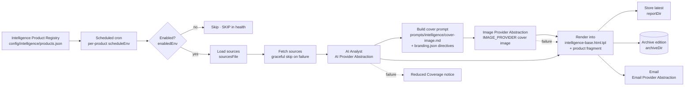

# Intelligence Products

The **intelligence framework** is how Jarvis turns open sources into
decision-grade, premium-branded daily briefs. It is **registry-driven**: every
brief is a declarative entry in a single registry, and the installer, validation,
health, status and backup frameworks all iterate that registry — so adding a new
intelligence product is a *configuration and module* change, never a core code
change (*Configuration over hard coding*, *Future expansion*).

> See also: [architecture.md](architecture.md#intelligence-product-framework) ·
> [operations.md](operations.md#intelligence-products) · [backup.md](backup.md) ·
> [recovery.md](recovery.md) · [modules/README.md](../modules/README.md)

## Table of contents

- [Overview](#overview)
- [The Intelligence Product Registry](#the-intelligence-product-registry)
- [Branding and regions configuration](#branding-and-regions-configuration)
- [Shipped products](#shipped-products)
  - [Daily Cyber Opportunities Intelligence Brief](#daily-cyber-opportunities-intelligence-brief)
  - [Daily Energy Intelligence Brief](#daily-energy-intelligence-brief)
- [The cover-image and branding system](#the-cover-image-and-branding-system)
- [Intelligence data flow](#intelligence-data-flow)
- [Monitoring, health, status and validation](#monitoring-health-status-and-validation)
- [Add a new intelligence product](#add-a-new-intelligence-product)
- [Troubleshooting](#troubleshooting)

## Overview

Jarvis ships three daily intelligence products, all built on the same reusable
framework:

| Product | Id | Module | Schedule (default) | Telegram |
| --- | --- | --- | --- | --- |
| Daily Cyber Threat Intelligence Brief | `cyber-brief` | `core` | `0 6 * * *` (06:00) | `/cyber` |
| Daily Cyber Opportunities Intelligence Brief | `cyber-opportunities` | `cyber-opportunities` | `15 6 * * *` (06:15) | `/opportunities` |
| Daily Energy Intelligence Brief | `energy-intelligence` | `energy-intelligence` | `30 6 * * *` (06:30) | `/energy` |

Each product:

- Loads sources from a plain-text source list (one URL per line).
- Analyses them with the **AI Provider Abstraction** (Ollama by default) using a
  versioned analyst prompt.
- Auto-generates a **premium cover image** via the **Image Provider Abstraction**
  (`IMAGE_PROVIDER`) from the brief's top stories.
- Renders **HTML / PDF / email / archive** outputs through the shared branded
  base template, giving every brief one consistent, premium house style.
- Emails the brief via the **Email Provider Abstraction** (`EMAIL_PROVIDER`).
- Archives every edition for history and search.

Every step has a **failure path**: a bad source, an unavailable
AI/image/email provider, or a disabled flag degrades gracefully rather than
breaking the brief (*Fail-safe defaults*). If image generation fails, the brief
still renders — just without a cover.

## The Intelligence Product Registry

[`config/intelligence/products.json`](../config/intelligence/products.json) is
the **single source of truth** for all intelligence products. Nothing in the
platform hardcodes a fixed list of briefs;
[`scripts/lib/intelligence.sh`](../scripts/lib/intelligence.sh) reads this
registry and the installer, validator, health check, status dashboard and
backup all iterate it.

Each product entry declares:

| Field | Meaning |
| --- | --- |
| `id` | Stable product id (e.g. `energy-intelligence`). |
| `name` | Human-readable product name. |
| `module` | Module that owns it (`core` for built-ins). |
| `status` | `active` to wire it into install/validate/health/backup. |
| `enabledEnv` / `enabledDefault` | Env toggle (e.g. `ENERGY_BRIEF_ENABLED`, default `true`). |
| `scheduleEnv` / `scheduleDefault` | Cron schedule env var + default. |
| `workflow` | Path to the n8n workflow (source of truth). |
| `prompt` | Analyst prompt id (resolved from the prompt registry). |
| `sourcesFile` | Source list path. |
| `reportDir` / `archiveDir` | Latest-output and archive directories. |
| `template` | Product content template (rendered into the shared base). |
| `outputs` | Output formats — `["html","pdf","email","archive"]`. |
| `coverImage` | Whether a cover image is generated. |
| `telegramCommand` | The Telegram command that fetches the latest edition. |

The shared library exposes these helpers (sourced, never executed):

| Function | Purpose |
| --- | --- |
| `intel_ids` | Newline list of product ids. |
| `intel_field <id> <field>` | Read a registry field (e.g. `name`, `scheduleDefault`). |
| `intel_enabled <id>` | Exit `0` if the product is enabled in the environment. |
| `intel_checks <id>` | Emit `STATUS|check|detail` lines (enablement, workflow present, sources count/reachability, report/archive dirs, latest archived edition, schedule). |

`intel_checks` output uses the platform-wide `PASS|WARN|FAIL|SKIP` vocabulary so
any caller can fold it into its own report. A disabled product reports `SKIP`,
never `FAIL`.

## Branding and regions configuration

Two non-secret config files make the framework reusable and consistently styled:

- [`config/intelligence/branding.json`](../config/intelligence/branding.json) —
  the **common branding framework** for *all* intelligence products. It defines
  the wordmark, tagline, palette (deep navy `#0A1A2F` + refined gold `#C9A24B`),
  typography, severity colours, footer disclaimer, and the cover-image
  `styleDirectives` / `negativeDirectives`. The shared base template and the
  cover-image prompt read these tokens, so a single change here re-skins every
  brief across HTML / PDF / email / cover image.
- [`config/intelligence/regions.json`](../config/intelligence/regions.json) —
  reusable region groupings (`gcc`, `secondary`, `global`) so products reference
  group ids instead of hardcoding country lists. Used by the opportunities brief
  for primary/secondary focus and available to any future module.

The shared base template
[`templates/report/intelligence-base.html.tpl`](../templates/report/intelligence-base.html.tpl)
mirrors the branding palette/typography and provides the cover, body and footer.
Each product supplies only a **content fragment** (its section skeleton) that is
rendered into the base template's `{{CONTENT}}` slot.

## Shipped products

### Daily Cyber Opportunities Intelligence Brief

> Module: [`modules/cyber-opportunities/`](../modules/cyber-opportunities) ·
> Id: `cyber-opportunities` · Telegram: `/opportunities`

Identifies **commercial cybersecurity opportunities** — RFPs, RFIs, government
tenders, managed security (MSS), security-awareness programmes, GRC, SOC,
vulnerability management, OT security, critical-infrastructure security, AI
security and cloud security.

- **Regions.** Primary GCC (UAE, Saudi Arabia, Qatar, Oman, Bahrain, Kuwait);
  secondary United Kingdom, Europe, Global strategic.
- **Schedule.** `15 6 * * *` (06:15 daily) via `CYBER_OPPS_SCHEDULE_CRON`.
- **Sources.**
  [`config/cyber-opportunities-sources.txt`](../config/cyber-opportunities-sources.txt)
  — GCC tender/procurement portals, UK/Europe public procurement, and managed
  security / industry signal feeds. Government portals that require authenticated
  search are listed as landing pages; the workflow fetches what it can and skips
  the rest.
- **Sections.** Executive Summary · Top Opportunities · Regional Breakdown ·
  High Priority Opportunities · Strategic Relevance · Recommended Actions · Win
  Probability Assessment · Opportunity Archive · Historical Trends.
- **Prompt.** [`prompts/analyst.md`](../modules/cyber-opportunities/prompts/analyst.md)
  (`cyber-opportunities.analyst`) — assigns an indicative **High / Medium / Low**
  win-probability score per high-priority opportunity (analytical aid, not a
  guarantee).
- **Outputs.** `reports/cyber-opportunities/` (latest) and
  `reports/archive/cyber-opportunities/` (Opportunity Archive / Historical
  Trends).

Configuration env vars (root `.env`; see
[`config/config.example.env`](../modules/cyber-opportunities/config/config.example.env)):

| Variable | Default | Meaning |
| --- | --- | --- |
| `CYBER_OPPS_ENABLED` | `true` | Enable/disable this product (fail-safe toggle). |
| `CYBER_OPPS_SCHEDULE_CRON` | `15 6 * * *` | Cron schedule (06:15 daily). |
| `CYBER_OPPS_PRIMARY_REGIONS` | `UAE,Saudi Arabia,Qatar,Oman,Bahrain,Kuwait` | Primary focus regions. |
| `CYBER_OPPS_SECONDARY_REGIONS` | `United Kingdom,Europe,Global` | Secondary focus regions. |
| `CYBER_OPPS_OUTPUT_FORMATS` | `html,pdf,email,archive` | Output formats. |
| `CYBER_OPPS_SOURCES_FILE` | `config/cyber-opportunities-sources.txt` | Source list. |

### Daily Energy Intelligence Brief

> Module: [`modules/energy-intelligence/`](../modules/energy-intelligence) ·
> Id: `energy-intelligence` · Telegram: `/energy`

Tracks strategic developments in the energy sector with a heavy focus on the
**UAE and the ADNOC ecosystem**, then regional and global oil & gas.

- **Focus.** Primary: ADNOC, ADNOC Gas, ADNOC Drilling, TAQA, Masdar, Borouge,
  TA'ZIZ, Mubadala Energy and the UAE energy sector. Secondary: Saudi Aramco,
  Shell, BP, Chevron, ExxonMobil, TotalEnergies, QatarEnergy — plus energy
  security, technology, AI, cybersecurity and digital transformation.
- **Schedule.** `30 6 * * *` (06:30 daily, configurable) via
  `ENERGY_BRIEF_SCHEDULE_CRON`.
- **Sources.** [`config/energy-sources.txt`](../config/energy-sources.txt) —
  UAE/ADNOC company newsrooms (primary), regional energy (secondary), global oil
  & gas majors, and sector/technology/security feeds.
- **Sections.** Executive Summary · Top Stories · ADNOC Focus · UAE Focus ·
  Regional Focus · Global Focus · Strategic Implications · Investment Activity ·
  Digital Transformation Activity · Cybersecurity Activity · Emerging Trends.
- **Prompt.** [`prompts/analyst.md`](../modules/energy-intelligence/prompts/analyst.md)
  (`energy-intelligence.analyst`) — organises output around the ADNOC ecosystem
  first.
- **Outputs.** `reports/energy-intelligence/` (latest) and
  `reports/archive/energy-intelligence/`.

Configuration env vars (root `.env`; see
[`config/config.example.env`](../modules/energy-intelligence/config/config.example.env)):

| Variable | Default | Meaning |
| --- | --- | --- |
| `ENERGY_BRIEF_ENABLED` | `true` | Enable/disable this product (fail-safe toggle). |
| `ENERGY_BRIEF_SCHEDULE_CRON` | `30 6 * * *` | Cron schedule (06:30 daily). |
| `ENERGY_BRIEF_PRIMARY_FOCUS` | `ADNOC,ADNOC Gas,ADNOC Drilling,TAQA,Masdar,Borouge,TA'ZIZ,Mubadala Energy,UAE Energy Sector` | Primary focus entities. |
| `ENERGY_BRIEF_SECONDARY_FOCUS` | `Saudi Aramco,Shell,BP,Chevron,ExxonMobil,TotalEnergies,QatarEnergy` | Secondary focus entities. |
| `ENERGY_BRIEF_OUTPUT_FORMATS` | `html,pdf,email,archive` | Output formats. |
| `ENERGY_BRIEF_SOURCES_FILE` | `config/energy-sources.txt` | Source list. |

## The cover-image and branding system

Every brief opens with an **AI-generated premium cover image**. The cover prompt
is built automatically from the brief's **top stories/opportunities** using the
shared prompt
[`prompts/intelligence/cover-image.md`](../prompts/intelligence/cover-image.md)
(`intelligence.cover-image`), which is provider-neutral by design — it describes
the image only, never a model, API, size or vendor.

The cover prompt builder is fed three things:

1. The product name and that day's `TOP_STORIES`.
2. `STYLE_DIRECTIVES` from `branding.json` — premium editorial, deep navy with
   refined gold accents, abstract non-literal motifs, restrained consultancy
   aesthetic.
3. `NEGATIVE_DIRECTIVES` from `branding.json` — no text, logos, watermarks,
   numeric charts, clipart or cartoons.

The resulting prompt is rendered through the **Image Provider Abstraction**
(`IMAGE_PROVIDER`, e.g. `openai`), honouring `IMAGE_SIZE` (default `1536x1024`).
Because the base template, content fragments and cover prompt all read the same
branding tokens, **a single change in `branding.json` re-skins all three briefs**
(Cyber, Cyber Opportunities, Energy) at once.

**Fail-safe:** if `IMAGE_PROVIDER` is unset or image generation fails, the brief
renders without a cover — the template's cover `` falls back gracefully —
rather than failing the run.

## Intelligence data flow



## Monitoring, health, status and validation

Because the registry is the source of truth, the operations frameworks cover
every product (including future ones) automatically:

- **Installer — Stage 8.** `stage_intelligence` in
  [`install.sh`](../install.sh) iterates the registry, ensures each product's
  `reportDir` / `archiveDir` exist, and logs each product's enabled state and
  schedule. Module workflows with `"autoImport": true` in their `module.json`
  are imported by [`workflow-import.sh`](../scripts/workflows/workflow-import.sh)
  (the importer discovers module workflow directories via
  `jarvis_autoimport_module_workflow_dirs` in
  [`scripts/lib/common.sh`](../scripts/lib/common.sh)).
- **Validation.** `scripts/validate.sh` adds an **Intelligence Config** check:
  the registry is valid JSON and every referenced workflow and template exists.

  ```bash
  scripts/validate.sh
  ```

- **Health.** `scripts/healthcheck.sh` adds per-product checks (via
  `intel_checks`) plus an **Image Provider** check (provider configured /
  credentials present / briefs render without a cover).

  ```bash
  scripts/healthcheck.sh --json
  ```

  Each module also ships its own health check that wraps the same shared library:

  ```bash
  modules/cyber-opportunities/healthcheck.sh --json
  modules/energy-intelligence/healthcheck.sh
  ```

- **Status.** `scripts/status.sh` shows an **Intelligence Products** panel —
  per-product enabled state, effective schedule and the latest archived edition.

  ```bash
  scripts/status.sh
  ```

- **Backup / recovery.** `backup.sh` now captures the `modules/` tree (so every
  product's workflow, prompt, config and docs are backed up) alongside
  `reports/` (including `reports/archive/`). `restore.sh` restores `modules/`,
  and products resume on their schedule after restore — verify with
  `scripts/healthcheck.sh`. See [backup.md](backup.md) and
  [recovery.md](recovery.md).

## Add a new intelligence product

Adding a new brief (Defence, AI, Government, Healthcare, Market intelligence, …)
follows the **same architecture** as the two shipped modules. **No core code
change is required** — only a module, a registry entry, a sources file, a
template, and optionally a Telegram command.

1. **Scaffold a module.** Copy [`modules/_template/`](../modules/_template) (or
   one of `cyber-opportunities` / `energy-intelligence`) to
   `modules/<your-product>/`. Fill in `module.json` with `"intelligence": true`,
   `"status": "active"`, `"autoImport": true`, and a `report` block listing the
   `sourcesFile`, `reportDir`, `archiveDir`, `template`, `coverImagePrompt`
   (`intelligence.cover-image`) and the product's section names. Declare its
   `envVars` (an `*_ENABLED`, an `*_SCHEDULE_CRON`, focus/region and output
   variables).

2. **Add the analyst prompt.** Create `prompts/analyst.md` with YAML frontmatter
   (`id`, `version`, `purpose`, `provider_agnostic: true`, `variables`) and the
   exact `##` section headers the template expects. Include a **Reduced
   Coverage** fallback. Register it in
   [`prompts/registry.json`](../prompts/registry.json) if referenced by id.

3. **Build the workflow.** Add `workflows/<your-product>.json` — schedule
   trigger → enable gate → load sources → AI analyst → build cover prompt →
   image provider → render (base template + your fragment) → store/archive/email,
   with a failure path on every external call. Validate it:

   ```bash
   scripts/workflows/workflow-validate.sh
   ```

4. **Add a sources file.** Create `config/<your-product>-sources.txt` (one URL
   per line, `#` for comments). Reuse `config/intelligence/regions.json` groups
   instead of hardcoding country lists where relevant.

5. **Add a template.** Create
   `templates/report/<your-product>.html.tpl` as a **content fragment** that
   renders into
   [`templates/report/intelligence-base.html.tpl`](../templates/report/intelligence-base.html.tpl)
   so it inherits the premium branding automatically.

6. **Register it.** Append an entry to
   [`config/intelligence/products.json`](../config/intelligence/products.json)
   with the `id`, `module`, `enabledEnv`/`scheduleEnv` (+ defaults), `workflow`,
   `prompt`, `sourcesFile`, `reportDir`, `archiveDir`, `template`, `outputs`,
   `coverImage` and (optionally) `telegramCommand`.

7. **(Optional) Telegram command.** Add an output to the Command Router switch in
   [`workflows/core/telegram-assistant.json`](../workflows/core/telegram-assistant.json).
   The shared **Latest Intelligence Brief** handler is registry-driven and serves
   any product's command (latest edition / history / org-or-date search).

8. **Wire it in.** Re-run the installer (idempotent) — Stage 8 ensures the new
   product's directories and reports it; `autoImport` imports the workflow:

   ```bash
   ./install.sh
   scripts/validate.sh        # Intelligence Config: all assets present
   scripts/healthcheck.sh     # new product checks appear
   scripts/status.sh          # new product in the Intelligence Products panel
   ```

That is the entire recipe: the installer, validator, health check, status
dashboard and backup pick up the new product **with no changes to their code**.

## Troubleshooting

| Symptom | Likely cause | Fix |
| --- | --- | --- |
| Brief shows a **"Reduced Coverage"** notice | Sources empty or unreachable | The analyst emits every section with "No data available for this period." rather than failing. Check the sources file and `*.reachability` in the module health check. |
| Brief renders **without a cover image** | `IMAGE_PROVIDER` unset, or no API key | Health check reports **Image Provider** as `SKIP`/`WARN`. Set `IMAGE_PROVIDER` and `OPENAI_IMAGE_API_KEY`/`OPENAI_API_KEY` in `.env`. The brief still renders without a cover (fail-safe). |
| A **source is unreachable** | Portal requires authenticated search, or is down | Government tender portals are listed as landing pages; the workflow fetches what it can and skips the rest. The module health check samples a few sources and reports `*.reachability`. |
| Product not in status/health output | `jq` missing, or registry invalid | `intel_ids` degrades to empty without `jq`; install `jq`. Run `scripts/validate.sh` — **Intelligence Config** flags invalid registry JSON or missing referenced assets. |
| Product not running on schedule | Disabled via env, or workflow not imported | Check `*_ENABLED` in `.env` (a disabled product reports `SKIP`). Confirm `"autoImport": true` and re-run `scripts/workflows/workflow-import.sh`. |
| Want to disable a brief temporarily | — | Set its `*_ENABLED=false` in `.env`. It reports `SKIP` everywhere and never `FAIL`. |
