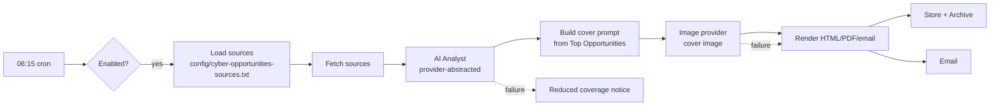

# Cyber Opportunities — Architecture & Operations

## Position in the platform

`cyber-opportunities` is an **intelligence product module**. It reuses, rather
than reinvents, every core framework:

| Concern | Reused framework |
|---------|------------------|
| Scheduling & execution | n8n workflow (`workflows/cyber-opportunities.json`) |
| AI analysis | AI Provider Abstraction (Ollama default) |
| Cover image | Image Provider Abstraction (`IMAGE_PROVIDER`) |
| Email delivery | Email Provider Abstraction (`EMAIL_PROVIDER`) |
| Visual style | Common branding framework (`config/intelligence/branding.json` + `templates/report/intelligence-base.html.tpl`) |
| Configuration | `.env` + `config/intelligence/products.json` + sources file |
| Discovery/health | `scripts/lib/intelligence.sh` + `healthcheck.sh` |
| Backup | Captured by `backup.sh` (modules + reports) |
| Import | `autoImport: true` → imported by `workflow-import.sh` |

## Data flow

## Win probability methodology

The analyst assigns an indicative **High / Medium / Low** score per high-priority
opportunity, weighing fit, competition, incumbency, timing and access. Scores are
analytical aids, **not guarantees**, and are clearly labelled as such.

## Adding/changing sources

Edit `config/cyber-opportunities-sources.txt` (one URL per line). Government
portals that require authenticated search are listed as landing pages; the
workflow fetches what it can and skips the rest (Fail-safe defaults). No workflow
edit required.

## Operations

- Run on demand: trigger the workflow in n8n, or send `/opportunities` in Telegram.
- Outputs: `reports/cyber-opportunities/` (latest) and
  `reports/archive/cyber-opportunities/` (Opportunity Archive / Historical Trends).
- Health: `modules/cyber-opportunities/healthcheck.sh` or the platform health check.
