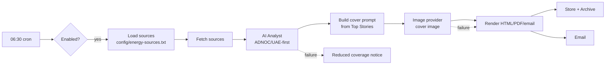

# Energy Intelligence — Architecture & Operations

## Position in the platform

`energy-intelligence` is an **intelligence product module** that reuses every
core framework rather than reinventing it (see the table in the cyber
opportunities overview — the architecture is identical, by design, so future
intelligence products follow the same shape).

| Concern | Reused framework |
|---------|------------------|
| Scheduling & execution | n8n workflow (`workflows/energy-intelligence.json`) |
| AI analysis | AI Provider Abstraction (Ollama default) |
| Cover image | Image Provider Abstraction (`IMAGE_PROVIDER`) |
| Email delivery | Email Provider Abstraction (`EMAIL_PROVIDER`) |
| Visual style | Common branding framework (`config/intelligence/branding.json`) |
| Configuration | `.env` + `config/intelligence/products.json` + sources file |
| Discovery/health | `scripts/lib/intelligence.sh` + `healthcheck.sh` |
| Backup | Captured by `backup.sh` (modules + reports) |
| Import | `autoImport: true` → imported by `workflow-import.sh` |

## Data flow

## Focus configuration

Primary/secondary focus entities are env-driven (`ENERGY_BRIEF_PRIMARY_FOCUS`,
`ENERGY_BRIEF_SECONDARY_FOCUS`) and the prompt organises output around the ADNOC
ecosystem first. Sources live in `config/energy-sources.txt` — add company
newsrooms or sector feeds without touching the workflow.

## Operations

- Run on demand: trigger in n8n, or send `/energy` in Telegram.
- Outputs: `reports/energy-intelligence/` and
  `reports/archive/energy-intelligence/`.
- Health: `modules/energy-intelligence/healthcheck.sh` or the platform health check.
